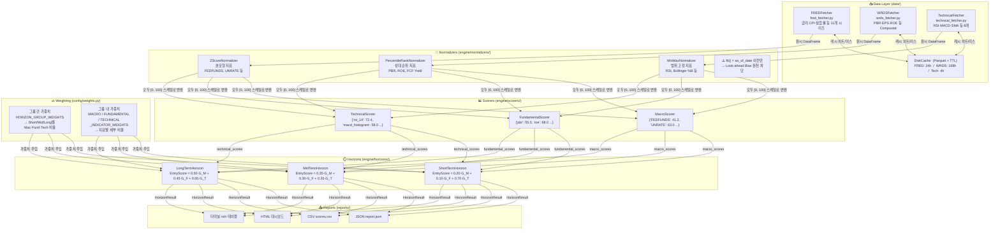

# Multi-Horizon Investment Decision Support System (MHIDSS)

> Macro × Fundamental × Technical 3개 데이터를 통합해
> **Short / Mid / Long 시계열별 Entry Score(0~100)**를 산출하는 투자 의사결정 지원 시스템

---

## 목차

1. [시스템 개요](#1-시스템-개요)
2. [데이터 흐름도](#2-데이터-흐름도)
3. [핵심 로직 — Entry Score 계산 공식](#3-핵심-로직--entry-score-계산-공식)
4. [설계 의도](#4-설계-의도)
5. [현재 사용 중인 지표 목록](#5-현재-사용-중인-지표-목록)
6. [수정 가이드 — 여기만 고치면 됩니다](#6-수정-가이드--여기만-고치면-됩니다)
7. [빠른 시작](#7-빠른-시작)
8. [프로젝트 구조](#8-프로젝트-구조)

---

## 1. 시스템 개요

```
입력: 티커 심볼 + 분석 기준일
출력: Short / Mid / Long 시계열별 Entry Score + 시그널
```

| 시계열 | 투자 호흡 | 지배적 데이터 | 의미 |
|--------|-----------|--------------|------|
| **Short** | 1~4주 | Technical (70%) | 단기 가격 모멘텀 기반 진입 타이밍 |
| **Mid** | 1~6개월 | 균등 (각 35/30/35%) | 이익 사이클 + 기술적 흐름 복합 판단 |
| **Long** | 6~24개월 | Macro (50%) + Fundamental (45%) | 매크로 레짐 + 내재가치 기반 포지션 구축 |

**시그널 분류:**

| Entry Score | 시그널 |
|-------------|--------|
| ≥ 70 | `STRONG_BUY` |
| ≥ 55 | `BUY` |
| ≥ 45 | `NEUTRAL` |
| ≥ 30 | `SELL` |
| < 30 | `STRONG_SELL` |

> 임계값은 `.env` 파일의 `SIGNAL_THRESHOLD_*` 변수로 조정 가능.

---

## 2. 데이터 흐름도



---

## 3. 핵심 로직 — Entry Score 계산 공식

### 3-1. 전체 수식 (3단계)

```
Step 1.  각 원시 지표값 → [0, 100] 정규화
         score_i = Normalizer_i.transform(raw_value_i)

Step 2.  그룹 내 가중 평균  (지표 단위 → 그룹 단위)
         G_M = Σ w_macro[i]   × score_i    (매크로 그룹)
         G_F = Σ w_fund[j]    × score_j    (펀더멘탈 그룹)
         G_T = Σ w_tech[k]    × score_k    (기술적 그룹)

Step 3.  시계열별 교차 그룹 합산  (그룹 단위 → 최종 점수)
         EntryScore = W_macro × G_M  +  W_fund × G_F  +  W_tech × G_T
```

### 3-2. 가중치 행렬

**그룹 간 가중치** — `config/weights.py` 9~11행

| 그룹 | Short | Mid | Long |
|------|-------|-----|------|
| Macro | 0.20 | 0.35 | **0.50** |
| Fundamental | 0.10 | 0.30 | **0.45** |
| Technical | **0.70** | 0.35 | 0.05 |

**매크로 그룹 내 가중치** — `config/weights.py` 16~45행

| 지표 | Short | Mid | Long |
|------|-------|-----|------|
| YIELD_CURVE_SPREAD | 0.15 | 0.20 | 0.25 |
| FEDFUNDS | 0.15 | 0.20 | 0.20 |
| CREDIT_SPREAD | 0.20 | 0.15 | 0.15 |
| CPIAUCSL (YoY) | 0.10 | 0.15 | 0.15 |
| PCEPILFE (YoY) | 0.10 | 0.10 | 0.10 |
| UNRATE | 0.10 | 0.10 | 0.10 |
| ICSA | 0.15 | 0.05 | 0.00 |
| M2SL (YoY) | 0.05 | 0.05 | 0.05 |

**펀더멘탈 그룹 내 가중치** — `config/weights.py` 49~77행

| 지표 | Short | Mid | Long |
|------|-------|-----|------|
| eps_change_rate | 0.30 | 0.25 | 0.15 |
| roe | 0.15 | 0.20 | 0.25 |
| fcf_yield | 0.15 | 0.20 | 0.25 |
| pbr | 0.10 | 0.15 | 0.20 |
| revenue_growth | 0.15 | 0.10 | 0.10 |
| de_ratio | 0.10 | 0.05 | 0.05 |
| earnings_yield | 0.05 | 0.05 | 0.00 |

**기술적 그룹 내 가중치** — `config/weights.py` 80~111행

| 지표 | Short | Mid | Long |
|------|-------|-----|------|
| rsi_14 | 0.20 | 0.15 | 0.00 |
| macd_histogram | 0.20 | 0.20 | 0.10 |
| sma_ratio | 0.10 | 0.20 | 0.40 |
| stoch_k | 0.15 | 0.10 | 0.00 |
| bb_pct_b | 0.15 | 0.10 | 0.00 |
| obv_slope | 0.10 | 0.10 | 0.20 |
| atr_norm | 0.05 | 0.05 | 0.15 |
| roc | 0.05 | 0.10 | 0.15 |

### 3-3. 정규화 방법 3종

| 방법 | 언제 쓰나 | 공식 |
|------|-----------|------|
| **MinMax** | 범위가 알려진 지표 (RSI 0~100, Bollinger %B 0~1) | `(x - min) / (max - min) × 100` |
| **Z-Score** | 정규분포형 지표 (금리, 실업률, MACD) | `clip((z + 3) / 6 × 100, 0, 100)` |
| **Percentile** | 상대적 위치가 중요한 지표 (PBR, ROE, FCF Yield) | `rank(x) / N × 100` |

- **방향성 반전** (`invert=True`): 금리↑가 나쁜 지표는 정규화 후 `100 - score`로 반전
- 각 지표의 방법·방향·윈도우 설정: `config/normalization.py`

### 3-4. 합산 공식이 있는 코드 위치

| 수정하고 싶은 것 | 파일 | 라인 |
|-----------------|------|------|
| 그룹 간 비율 (Short의 Tech 70%를 낮추기 등) | `config/weights.py` | 9~11 |
| 매크로 지표별 비중 | `config/weights.py` | 16~45 |
| 펀더멘탈 지표별 비중 | `config/weights.py` | 49~77 |
| 기술적 지표별 비중 | `config/weights.py` | 80~111 |
| 합산 공식 자체 (비선형 변환 추가 등) | `engine/horizons/short_term.py` | 41 |
| 시그널 임계값 (BUY 기준 55 → 60으로) | `engine/horizons/base.py` | 21~30 또는 `.env` |
| 정규화 방법 변경 (RSI를 MinMax → Percentile로) | `config/normalization.py` | 해당 지표 행 |

---

## 4. 설계 의도

### 왜 이렇게 파일을 세분화했는가

각 파일은 **"변경되는 이유"가 하나**입니다.

```
config/weights.py          ← 투자 철학이 바뀔 때만 수정
config/normalization.py    ← 정규화 방법론이 바뀔 때만 수정
data/fetchers/wrds_fetcher.py  ← WRDS 쿼리 구조가 바뀔 때만 수정
engine/normalizers/zscore.py   ← Z-Score 알고리즘 자체를 바꿀 때만 수정
engine/horizons/short_term.py  ← Short-term 합산 로직만 바꿀 때만 수정
```

이렇게 분리하면 **"가중치를 바꾸다가 정규화 코드를 실수로 건드리는"** 일이 구조적으로 불가능합니다.

### Look-ahead Bias 차단 구조

백테스트의 가장 흔한 오류는 미래 데이터로 현재를 정규화하는 것입니다.
이 시스템은 `BaseNormalizer.fit()`이 반드시 `as_of_date` **이전** 데이터만 받도록 API 계약이 걸려 있습니다.

```python
# engine/scorers/macro_scorer.py — 정규화기 fit 시 과거 데이터만 전달
history = self._historical.loc[:as_of_date, indicator_id].dropna()
normalizer.fit(history)  # ← as_of_date 이전만
```

### 누락 지표 처리

WRDS 데이터가 특정 분기에 없거나, 기술적 지표 계산에 데이터가 부족할 때:
- **0점 처리 금지** → 인위적 패널티 발생
- 대신 `INSUFFICIENT_DATA` 플래그 후 해당 지표의 가중치를 **같은 그룹 내 나머지 지표에 비례 재분배**

---

## 5. 현재 사용 중인 지표 목록

### 매크로 (FRED API) — 11개

| 지표명 | FRED ID | 변환 | 방향 |
|--------|---------|------|------|
| 연방기금금리 | `FEDFUNDS` | Z-Score | 높을수록 나쁨 ↓ |
| 10년 국채 수익률 | `DGS10` | Z-Score | 높을수록 나쁨 ↓ |
| 2년 국채 수익률 | `DGS2` | Z-Score | 높을수록 나쁨 ↓ |
| 장단기 금리차 (10Y-2Y) | 파생: DGS10-DGS2 | MinMax (-3~4%) | 높을수록 좋음 ↑ |
| CPI YoY | `CPIAUCSL` | MinMax (0~10%) | 높을수록 나쁨 ↓ |
| 근원 PCE YoY | `PCEPILFE` | MinMax (0~8%) | 높을수록 나쁨 ↓ |
| 실업률 | `UNRATE` | Z-Score | 높을수록 나쁨 ↓ |
| 신규 실업수당 청구 | `ICSA` | Z-Score | 높을수록 나쁨 ↓ |
| M2 통화량 YoY | `M2SL` | Z-Score | 높을수록 좋음 ↑ |
| BAA-AAA 크레딧 스프레드 | 파생: BAA-AAA | MinMax (0~5%) | 높을수록 나쁨 ↓ |

### 펀더멘탈 (WRDS Compustat) — 7개

| 지표명 | 계산식 | Compustat 필드 | 정규화 |
|--------|--------|----------------|--------|
| PBR | `prcc_f / (ceq / csho)` | `prcc_f, ceq, csho` | Percentile ↓ |
| EPS 변화율 (YoY) | `(eps_t - eps_{t-4}) / \|eps_{t-4}\|` | `epsfx` | Z-Score ↑ |
| ROE | `ni / ceq` | `ni, ceq` | Percentile ↑ |
| FCF Yield | `(oancf - capx) / mkvalt` | `oancf, capx, mkvalt` | Percentile ↑ |
| 부채비율 (D/E) | `(dltt + dlc) / ceq` | `dltt, dlc, ceq` | Percentile ↓ |
| 매출 성장률 (YoY) | `(sale_t - sale_{t-4}) / sale_{t-4}` | `sale` | Z-Score ↑ |
| Earnings Yield | `epsfx / prcc_f` | `epsfx, prcc_f` | Percentile ↑ |

> **집계 방식**: S&P 500 유니버스 기준 시장 **중위값(median)** 사용.
> **Point-in-time**: `rdq`(실적발표일) 기준으로 `as_of_date` 이전 데이터만 사용 (look-ahead bias 차단).

### 기술적 지표 (yfinance + pandas-ta) — 8개

| 지표명 | 파라미터 | 정규화 | 특이사항 |
|--------|---------|--------|---------|
| RSI | 14일 | MinMax (0~100) | **V자형 비선형** 스코어링 적용 |
| MACD Histogram | 12/26/9 | Z-Score | |
| SMA50/SMA200 Ratio | - | MinMax (0.85~1.15) | 골든크로스 기준 |
| Stochastic %K | 14/3 | MinMax (0~100) | |
| Bollinger %B | 20일/2σ | MinMax (0~1) | |
| OBV Slope | 20일 선형 기울기 | Z-Score | |
| ATR (정규화) | ATR(14) / Close | Z-Score | 변동성 지표 (높으면 나쁨 ↓) |
| ROC | 10일 | Z-Score | |

> **RSI V자형 스코어링**: RSI=30(과매도) → 100점, RSI=70(과매수) → 0점, RSI=50 → 50점.
> 구현 위치: `engine/scorers/technical_scorer.py:11~16`

---

## 6. 수정 가이드 — 여기만 고치면 됩니다

### A. 펀더멘탈 지표를 추가/변경하려면

**Step 1** — `config/wrds_fields.py`에 새 필드 추가
```python
# FINANCIAL_FIELDS 리스트에 컬럼 추가
FINANCIAL_FIELDS = [..., "new_field"]

# DERIVED_FIELDS에 계산식 등록
DERIVED_FIELDS["new_indicator"] = ("numerator_expr", "denominator_expr")
```

**Step 2** — `config/normalization.py`의 `FUNDAMENTAL_NORM`에 정규화 방법 등록
```python
FUNDAMENTAL_NORM["new_indicator"] = NormConfig("percentile", invert=False, window_years=5)
```

**Step 3** — `config/weights.py`의 `FUNDAMENTAL_INDICATOR_WEIGHTS`에 가중치 추가
```python
"short": {
    ...,
    "new_indicator": 0.10,   # 합계가 1.0이 되도록 기존 값 조정
}
```

**Step 4** — `data/fetchers/wrds_fetcher.py`의 `_compute_derived()`에 계산 로직 추가

---

### B. 그룹 간 가중치를 바꾸려면

`config/weights.py` **9~11행**만 수정. **합계는 반드시 1.0**이어야 함.

```python
HORIZON_GROUP_WEIGHTS = {
    "short": {"macro": 0.20, "fundamental": 0.10, "technical": 0.70},  # ← 여기
    "mid":   {"macro": 0.35, "fundamental": 0.30, "technical": 0.35},  # ← 여기
    "long":  {"macro": 0.50, "fundamental": 0.45, "technical": 0.05},  # ← 여기
}
```

---

### C. 매크로 지표를 추가하려면

**Step 1** — `config/fred_series.py`에 시리즈 ID 상수 추가
```python
UMCSENT = "UMCSENT"  # 소비자신뢰지수 예시
FETCH_SERIES = [..., UMCSENT]
```

**Step 2** — `config/normalization.py`의 `MACRO_NORM`에 정규화 설정 추가

**Step 3** — `config/weights.py`의 `MACRO_INDICATOR_WEIGHTS`에 비중 추가

---

### D. 시그널 임계값을 바꾸려면

`.env` 파일에서 직접 수정 (코드 변경 불필요):
```
SIGNAL_THRESHOLD_STRONG_BUY=70
SIGNAL_THRESHOLD_BUY=55
SIGNAL_THRESHOLD_NEUTRAL=45
SIGNAL_THRESHOLD_SELL=30
```

---

### E. 정규화 방법을 바꾸려면

`config/normalization.py`에서 해당 지표의 `NormConfig`만 수정:
```python
# 예: PBR를 Percentile → Z-Score로 변경
FUNDAMENTAL_NORM["pbr"] = NormConfig("zscore", invert=True, window_years=5)
```

---

## 7. 빠른 시작

### 환경 설정

```bash
# 1. 의존성 설치
pip install -e ".[dev]"

# 2. 환경 변수 설정
cp .env.example .env
# .env 파일에서 FRED_API_KEY, WRDS_USERNAME, WRDS_PASSWORD 입력
```

### 실행

```bash
# SPY 분석 (오늘 기준, JSON + HTML 출력)
python main.py run SPY

# 특정 날짜 기준
python main.py run SPY --date 2024-01-01

# Short-term만 출력
python main.py run SPY --horizon short

# 연결 상태 확인
python main.py check-connections

# 설정 검증
python main.py validate-config
```

### 테스트

```bash
# 단위 테스트 (외부 API 불필요)
pytest tests/unit/ -v

# FRED 연결 테스트 (API 키 필요)
pytest tests/integration/test_fred_live.py -v
```

---

## 8. 프로젝트 구조

```
mhidss/
│
├── config/                      ← 수정 빈도가 가장 높은 곳
│   ├── weights.py               ★ 가중치 행렬 (투자 철학의 핵심)
│   ├── normalization.py         ★ 지표별 정규화 전략
│   ├── fred_series.py           FRED 시리즈 ID 상수
│   ├── wrds_fields.py           WRDS 테이블/필드 레지스트리
│   └── settings.py              환경변수 로더
│
├── data/
│   ├── fetchers/
│   │   ├── base.py              BaseFetcher 인터페이스
│   │   ├── fred_fetcher.py      FRED API 클라이언트
│   │   ├── wrds_fetcher.py      WRDS Compustat 클라이언트
│   │   └── technical_fetcher.py yfinance + pandas-ta
│   ├── cache/
│   │   └── disk_cache.py        Parquet TTL 캐시
│   └── models/                  데이터 스냅샷 모델 (dataclass)
│
├── engine/
│   ├── normalizers/
│   │   ├── base.py              ★ fit/transform 계약 (look-ahead bias 차단)
│   │   ├── minmax.py
│   │   ├── zscore.py
│   │   └── percentile.py
│   ├── scorers/
│   │   ├── macro_scorer.py      FRED 지표 → 0~100 점수
│   │   ├── fundamental_scorer.py WRDS 지표 → 0~100 점수
│   │   └── technical_scorer.py  기술적 지표 → 0~100 점수
│   ├── horizons/
│   │   ├── base.py              HorizonResult 데이터클래스
│   │   ├── short_term.py        ★ Short 합산 공식 (line 41)
│   │   ├── mid_term.py          ★ Mid 합산 공식 (line 41)
│   │   └── long_term.py         ★ Long 합산 공식 (line 41)
│   └── entry_score.py           전체 파이프라인 오케스트레이터
│
├── utils/
│   ├── date_utils.py            날짜·거래일 처리
│   ├── math_utils.py            가중치 재분배, 롤링 기울기
│   ├── retry.py                 지수 백오프 재시도
│   ├── logging.py               structlog 설정
│   └── validation.py            Pydantic 검증 모델
│
├── reports/
│   ├── formatters/
│   │   ├── json_formatter.py
│   │   ├── csv_formatter.py
│   │   └── html_formatter.py    Jinja2 HTML 대시보드
│   └── report_builder.py        포맷터 오케스트레이터
│
├── tests/
│   ├── conftest.py              공유 pytest 픽스처
│   ├── unit/                    38개 단위 테스트 (API 불필요)
│   └── integration/             실제 API 연결 테스트
│
├── main.py                      CLI 진입점 (typer)
├── pyproject.toml               의존성 & 빌드 설정
├── .env.example                 환경변수 템플릿
└── CLAUDE.md                    Claude Code용 프로젝트 가이드
```

> `★` 표시 파일이 가장 자주 수정하게 될 핵심 파일입니다.

---

## 의존성

| 라이브러리 | 용도 |
|-----------|------|
| `fredapi` | FRED API Python 래퍼 |
| `wrds` | WRDS PostgreSQL 연결 |
| `pandas`, `numpy` | 데이터 처리 |
| `pandas-ta` | 기술적 지표 계산 |
| `yfinance` | 가격 데이터 (개발/기본값) |
| `pydantic` | 런타임 데이터 검증 |
| `typer`, `rich` | CLI & 터미널 출력 |
| `jinja2` | HTML 리포트 템플릿 |
| `pyarrow` | Parquet 캐시 |
| `python-dotenv` | 환경변수 관리 |
| `tenacity` | API 재시도 로직 |
