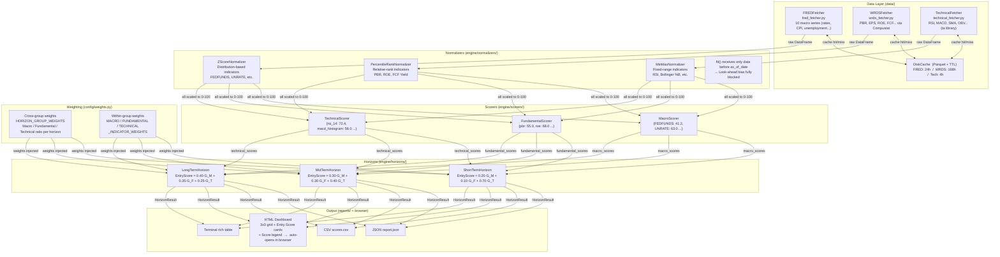

# Multi-Horizon Investment Decision Support System (MHIDSS)

> Integrates **Fundamental × Macro × Technical** data to produce
> **Entry Scores (0 – 100)** across Short / Mid / Long investment horizons,
> delivered via a **web dashboard** at `http://localhost:5000`.

---

## Table of Contents

1. [System Overview](#1-system-overview)
2. [Data Flow](#2-data-flow)
3. [Entry Score Calculation](#3-entry-score-calculation)
4. [Design Rationale](#4-design-rationale)
5. [Indicators Reference](#5-indicators-reference)
6. [Modification Guide](#6-modification-guide)
7. [Quick Start](#7-quick-start)
8. [Project Structure](#8-project-structure)
9. [Dependencies](#9-dependencies)

---

## 1. System Overview

```
Input : ticker symbol or company name  +  reference date
Output: Short / Mid / Long Entry Scores + signals

Interfaces:
  Web app  →  python web/app.py          (http://localhost:5000)
               - Analyze tab  : single ticker dashboard
               - Compare tab  : two tickers side by side (parallel)
  CLI      →  python main.py run AAPL    (writes HTML to output/)
```

| Horizon | Holding Period | Dominant Data | Purpose |
|---------|---------------|---------------|---------|
| **Short** | 1 – 4 weeks | Technical (70%) | Short-term price momentum entry timing |
| **Mid** | 1 – 6 months | Balanced (30 / 30 / 40%) | Earnings cycle + technical trend composite |
| **Long** | 6 – 24 months | Macro (40%) + Fundamental (35%) + Technical (25%) | Macro regime + intrinsic-value position building |

**Signal classification:**

| Entry Score | Signal |
|-------------|--------|
| ≥ 70 | `STRONG BUY` |
| ≥ 55 | `BUY` |
| ≥ 45 | `NEUTRAL` |
| ≥ 30 | `SELL` |
| < 30 | `STRONG SELL` |

> Thresholds are adjustable via `SIGNAL_THRESHOLD_*` variables in `.env`.

---

## 2. Data Flow



---

## 3. Entry Score Calculation

### 3-1. Three-Step Formula

```
Step 1.  Normalize each raw indicator to [0, 100]
         score_i = Normalizer_i.transform(raw_value_i)

Step 2.  Within-group weighted average  (indicator level → group level)
         G_M = Σ w_macro[i]  × score_i    (Macro group)
         G_F = Σ w_fund[j]   × score_j    (Fundamental group)
         G_T = Σ w_tech[k]   × score_k    (Technical group)

Step 3.  Cross-group weighted sum per horizon  (group level → final score)
         EntryScore = W_macro × G_M  +  W_fund × G_F  +  W_tech × G_T
```

### 3-2. Weight Matrix

**Cross-group weights** — `config/weights.py` lines 9–11

| Group | Short | Mid | Long |
|-------|-------|-----|------|
| Macro | 0.20 | 0.30 | **0.40** |
| Fundamental | 0.10 | 0.30 | **0.35** |
| Technical | **0.70** | 0.40 | 0.25 |

**Macro within-group weights** — `config/weights.py` lines 16–45

| Indicator | Short | Mid | Long |
|-----------|-------|-----|------|
| YIELD_CURVE_SPREAD | 0.15 | 0.20 | 0.25 |
| FEDFUNDS | 0.15 | 0.20 | 0.20 |
| CREDIT_SPREAD | 0.20 | 0.15 | 0.15 |
| CPIAUCSL (YoY) | 0.10 | 0.15 | 0.15 |
| PCEPILFE (YoY) | 0.10 | 0.10 | 0.10 |
| UNRATE | 0.10 | 0.10 | 0.10 |
| ICSA | 0.15 | 0.05 | 0.00 |
| M2SL (YoY) | 0.05 | 0.05 | 0.05 |

**Fundamental within-group weights** — `config/weights.py` lines 49–77

| Indicator | Short | Mid | Long |
|-----------|-------|-----|------|
| eps_change_rate | 0.30 | 0.25 | 0.15 |
| roe | 0.15 | 0.20 | 0.25 |
| fcf_yield | 0.15 | 0.20 | 0.25 |
| pbr | 0.10 | 0.15 | 0.20 |
| revenue_growth | 0.15 | 0.10 | 0.10 |
| de_ratio | 0.10 | 0.05 | 0.05 |
| earnings_yield | 0.05 | 0.05 | 0.00 |

> Fundamental scores use **within-sector z-score normalization** (Barra USE4 / AQR QMJ methodology).
> Each company is benchmarked only against peers in the same GICS sector (11 sectors supported).
> Sector-specific weights are defined in `config/normalization.py` (`SECTOR_FUNDAMENTAL_WEIGHTS`).

**Technical within-group weights** — `config/weights.py` lines 80–111

| Indicator | Short | Mid | Long |
|-----------|-------|-----|------|
| rsi_14 | 0.20 | 0.15 | 0.15 |
| macd_histogram | 0.20 | 0.20 | 0.20 |
| sma_ratio | 0.10 | 0.25 | 0.30 |
| stoch_k | 0.15 | 0.10 | 0.00 |
| bb_pct_b | 0.15 | 0.10 | 0.00 |
| obv_slope | 0.10 | 0.15 | 0.20 |
| atr_norm | 0.05 | 0.00 | 0.05 |
| roc | 0.05 | 0.05 | 0.10 |

### 3-3. Three Normalization Methods

| Method | When Used | Formula |
|--------|-----------|---------|
| **MinMax** | Known-range indicators (RSI 0–100, Bollinger %B 0–1) | `(x − min) / (max − min) × 100` |
| **Z-Score** | Normally distributed indicators (rates, unemployment, MACD) | `clip((z + 3) / 6 × 100, 0, 100)` |
| **Percentile** | Relative-rank indicators (PBR, ROE, FCF Yield) | `rank(x) / N × 100` |

- **Direction inversion** (`invert=True`): indicators where higher = worse are inverted via `100 − score`
- Method, direction, and window for each indicator: `config/normalization.py`

### 3-4. Where Formulas Live in Code

| What to change | File | Line |
|----------------|------|------|
| Cross-group ratios (e.g. lower Short Tech from 70%) | `config/weights.py` | 9–11 |
| Macro indicator weights | `config/weights.py` | 16–45 |
| Fundamental indicator weights | `config/weights.py` | 49–77 |
| Technical indicator weights | `config/weights.py` | 80–111 |
| Aggregation formula itself | `engine/horizons/short_term.py` | 41 |
| Signal thresholds (e.g. BUY cutoff 55 → 60) | `engine/horizons/base.py` or `.env` | 21–30 |
| Normalization method for an indicator | `config/normalization.py` | target row |

---

## 4. Design Rationale

### Why this many files?

Each file has **exactly one reason to change**:

```
config/weights.py               ← change only when investment philosophy changes
config/normalization.py         ← change only when normalization methodology changes
data/fetchers/wrds_fetcher.py   ← change only when WRDS query structure changes
engine/normalizers/zscore.py    ← change only when z-score algorithm itself changes
engine/horizons/short_term.py   ← change only when Short-term aggregation changes
```

This structure makes it structurally impossible to accidentally break normalization logic while adjusting weights.

### Look-ahead Bias Prevention

The most common backtest error is normalizing current data using future information.
`BaseNormalizer.fit()` has an API contract that strictly accepts only data **before** `as_of_date`:

```python
# engine/scorers/macro_scorer.py — only past data passed to normalizer fit
history = self._historical.loc[:as_of_date, indicator_id].dropna()
normalizer.fit(history)  # ← as_of_date exclusive
```

### Missing Data Handling

When WRDS data is absent for a period or technical indicators lack sufficient bars:
- **No zero-scoring** — would create artificial penalty
- Instead, flag as `INSUFFICIENT_DATA` and **proportionally redistribute** that indicator's weight to remaining indicators in the same group

---

## 5. Indicators Reference

### Macro (FRED API) — 10 indicators

| Indicator | FRED ID | Normalization | Direction |
|-----------|---------|---------------|-----------|
| Federal Funds Rate | `FEDFUNDS` | Z-Score | Higher = worse ↓ |
| 10Y Treasury Yield | `DGS10` | Z-Score | Higher = worse ↓ |
| 2Y Treasury Yield | `DGS2` | Z-Score | Higher = worse ↓ |
| Yield Curve Spread (10Y−2Y) | derived: DGS10−DGS2 | MinMax (−3 to +4%) | Higher = better ↑ |
| CPI YoY | `CPIAUCSL` | MinMax (0–10%) | Higher = worse ↓ |
| Core PCE YoY | `PCEPILFE` | MinMax (0–8%) | Higher = worse ↓ |
| Unemployment Rate | `UNRATE` | Z-Score | Higher = worse ↓ |
| Initial Jobless Claims | `ICSA` | Z-Score | Higher = worse ↓ |
| M2 Money Supply YoY | `M2SL` | Z-Score | Higher = better ↑ |
| BAA−AAA Credit Spread | derived: BAA−AAA | MinMax (0–5%) | Higher = worse ↓ |

### Fundamental (WRDS Compustat) — 7 indicators

Scored using **within-sector z-score** (minimum 10 peers per sector required).

| Indicator | Formula | Compustat Fields | Normalization |
|-----------|---------|-----------------|---------------|
| PBR | `prcc_f / (ceq / csho)` | `prcc_f, ceq, csho` | Percentile ↓ |
| EPS Change Rate (YoY) | `(eps_t − eps_{t−1}) / \|eps_{t−1}\|` | `epsfx` | Z-Score ↑ |
| ROE | `ni / ceq` | `ni, ceq` | Percentile ↑ |
| FCF Yield | `(oancf − capx) / mkvalt` | `oancf, capx, mkvalt` | Percentile ↑ |
| D/E Ratio | `(dltt + dlc) / ceq` | `dltt, dlc, ceq` | Percentile ↓ |
| Revenue Growth (YoY) | `(sale_t − sale_{t−1}) / sale_{t−1}` | `sale` | Z-Score ↑ |
| Earnings Yield | `epsfx / prcc_f` | `epsfx, prcc_f` | Percentile ↑ |

> **Point-in-time**: only data with `datadate ≤ as_of_date` is used (look-ahead bias blocked).
> **1–99% winsorization** applied before computing sector mean/std to suppress outliers.

### Technical (yfinance + ta) — 8 indicators, 3 resolutions

| Indicator | Parameters | Normalization | Notes |
|-----------|-----------|---------------|-------|
| RSI | 14-period | MinMax (0–100) | **V-shape non-linear** scoring applied |
| MACD Histogram | 12/26/9 | Z-Score | |
| SMA Fast/Slow Ratio | Daily: 50/200 · Weekly: 20/100 · Monthly: 10/40 | MinMax (0.85–1.15) | Golden cross basis |
| Stochastic %K | 14/3 | MinMax (0–100) | |
| Bollinger %B | 20-period / 2σ | MinMax (0–1) | |
| OBV Slope | 20-bar linear slope | Z-Score | |
| Normalized ATR | ATR(14) / Close | Z-Score | Volatility — higher = worse ↓ |
| ROC | 10-period | Z-Score | |

> **RSI V-shape scoring**: RSI=30 (oversold) → 100 pts, RSI=70 (overbought) → 0 pts, RSI=50 → 50 pts.
> Implementation: `engine/scorers/technical_scorer.py` lines 11–16

**Resolution mapping:**

| Horizon | Resolution | SMA Pair |
|---------|-----------|---------|
| Short | Daily | SMA 50 / 200 |
| Mid | Weekly | SMA 20 / 100 |
| Long | Monthly | SMA 10 / 40 |

---

## 6. Modification Guide

### A. Add or change a Fundamental indicator

**Step 1** — Add field to `config/wrds_fields.py`
```python
FINANCIAL_FIELDS = [..., "new_field"]
DERIVED_FIELDS["new_indicator"] = ("numerator_expr", "denominator_expr")
```

**Step 2** — Register normalization config in `config/normalization.py`
```python
FUNDAMENTAL_NORM["new_indicator"] = NormConfig("percentile", invert=False, window_years=5)
```

**Step 3** — Add weight in `config/weights.py` under `FUNDAMENTAL_INDICATOR_WEIGHTS`
```python
"short": {
    ...,
    "new_indicator": 0.10,   # adjust others so sum remains 1.0
}
```

**Step 4** — Add computation logic to `_compute_derived()` in `data/fetchers/wrds_fetcher.py`

---

### B. Change cross-group weights

Edit only lines 9–11 of `config/weights.py`. **Sum must equal 1.0.**

```python
HORIZON_GROUP_WEIGHTS = {
    "short": {"macro": 0.20, "fundamental": 0.10, "technical": 0.70},
    "mid":   {"macro": 0.30, "fundamental": 0.30, "technical": 0.40},
    "long":  {"macro": 0.40, "fundamental": 0.35, "technical": 0.25},
}
```

---

### C. Add a Macro indicator

**Step 1** — Add series ID constant to `config/fred_series.py`
```python
UMCSENT = "UMCSENT"   # Consumer Sentiment example
FETCH_SERIES = [..., UMCSENT]
```

**Step 2** — Add normalization config to `MACRO_NORM` in `config/normalization.py`

**Step 3** — Add weight to `MACRO_INDICATOR_WEIGHTS` in `config/weights.py`

---

### D. Adjust signal thresholds

Edit `.env` directly — no code change needed:
```
SIGNAL_THRESHOLD_STRONG_BUY=70
SIGNAL_THRESHOLD_BUY=55
SIGNAL_THRESHOLD_NEUTRAL=45
SIGNAL_THRESHOLD_SELL=30
```

---

### E. Change a normalization method

Edit the relevant `NormConfig` in `config/normalization.py`:
```python
# Example: change PBR from Percentile to Z-Score
FUNDAMENTAL_NORM["pbr"] = NormConfig("zscore", invert=True, window_years=5)
```

---

## 7. Quick Start

### Setup

```bash
# 1. Install dependencies
pip install -e ".[dev]"

# 2. Configure environment variables
cp .env.example .env
# Fill in FRED_API_KEY, WRDS_USERNAME, WRDS_PASSWORD in .env
```

### Running — Web App (recommended)

The primary interface is a Flask web app that serves an interactive dashboard at `http://localhost:5000`.

```bash
python web/app.py
```

The browser opens automatically. The app exposes two modes via the top navigation tabs:

| Tab | Endpoint | Description |
|-----|----------|-------------|
| **Analyze** | `POST /api/analyze` | Enter one ticker or company name → get Short / Mid / Long Entry Scores with group subscores |
| **Compare** | `POST /api/compare` | Enter two tickers → run both analyses in parallel and display side-by-side |

**Input fields (both modes):**
- **Ticker / Company name** — e.g. `AAPL`, `Apple`, `애플` (auto-resolved via yfinance Search)
- **Reference date** — defaults to today; set a past date for historical analysis (format: `YYYY-MM-DD`)

**Rate limits:** 10 requests/min per endpoint, 60 requests/min overall.

**Dashboard layout (Analyze mode):**

```
┌─────────────────────────────────────────────────────────┐
│  AAPL  [Information Technology]         $178.50  Live  │
│                                         As of 2026-03-23│
├──────────────────┬─────────────┬─────────────┬──────────┤
│                  │    SHORT    │     MID     │   LONG   │
│                  │  1–4 weeks  │  1–6 months │ 6–24 mo  │
├──────────────────┼─────────────┼─────────────┼──────────┤
│  Fundamental     │  62.3  BUY  │ 58.1  NEUT  │ 71.2  ★ │
├──────────────────┼─────────────┼─────────────┼──────────┤
│  Macro           │  45.2  NEUT │ 62.0  BUY   │ 68.5 BUY│
├──────────────────┼─────────────┼─────────────┼──────────┤
│  Technical       │  75.1  ★★  │ 55.3  BUY   │ 48.2 NEU│
├──────────────────┴─────────────┴─────────────┴──────────┤
│  SHORT  43.5  SELL    MID  48.0  NEUTRAL   LONG  52.2   │
│  ██░░ 20/10/70   ████ 30/30/40   ████░ 40/35/25          │
├─────────────────────────────────────────────────────────┤
│  SCORE GUIDE  │  STRONG BUY 70–100 │ BUY 55–69         │
│               │  NEUTRAL 45–54     │ SELL 30–44         │
│               │  STRONG SELL 0–29                       │
└─────────────────────────────────────────────────────────┘
```

- **Live** badge: price is real-time (market hours)
- **Close** badge: price is previous close (after hours / weekend)

**Compare mode** renders the same grid for two tickers side by side, with both analyses running in parallel.

---

### Running — CLI (alternative)

```bash
# Single ticker — generates HTML file and opens browser
python main.py run AAPL

# Multiple tickers — opens one dashboard tab per ticker
python main.py run AAPL MSFT NVDA GOOGL

# Company names are supported (auto-resolved via yfinance Search)
python main.py run "Apple" "Microsoft" "Nvidia"

# Specific reference date
python main.py run AAPL --date 2024-01-01

# Short-term horizon only
python main.py run AAPL --horizon short

# Suppress browser auto-open
python main.py run AAPL --no-browser

# Utility commands
python main.py check-connections    # verify FRED / WRDS connectivity
python main.py validate-config      # validate .env and config constants
python main.py clear-cache --older-than 7d
```

> The CLI writes self-contained HTML files to `output/` and opens them in the browser.
> The web app serves the same analysis live without writing files.

### Tests

```bash
# Unit tests (no external API required)
pytest tests/unit/ -v

# FRED connectivity test (requires API key)
pytest tests/integration/test_fred_live.py -v
```

---

## 8. Project Structure

```
mhidss/
│
├── config/                          ← most frequently modified
│   ├── weights.py               ★  weight matrix (core investment philosophy)
│   ├── normalization.py         ★  per-indicator normalization strategy
│   ├── fred_series.py               FRED series ID constants
│   ├── wrds_fields.py               WRDS table/field registry
│   └── settings.py                  environment variable loader
│
├── data/
│   ├── fetchers/
│   │   ├── base.py                  BaseFetcher interface
│   │   ├── fred_fetcher.py          FRED API client
│   │   ├── wrds_fetcher.py          WRDS Compustat client
│   │   └── technical_fetcher.py     yfinance + ta library (daily/weekly/monthly)
│   ├── cache/
│   │   └── disk_cache.py            Parquet TTL cache
│   └── models/                      data snapshot dataclasses
│
├── engine/
│   ├── normalizers/
│   │   ├── base.py              ★  fit/transform contract (look-ahead bias guard)
│   │   ├── minmax.py
│   │   ├── zscore.py
│   │   └── percentile.py
│   ├── scorers/
│   │   ├── macro_scorer.py          FRED indicators → 0–100 scores
│   │   ├── fundamental_scorer.py    WRDS indicators → 0–100 scores (within-sector z-score)
│   │   └── technical_scorer.py      Technical indicators → 0–100 scores
│   ├── horizons/
│   │   ├── base.py                  HorizonResult dataclass + signal thresholds
│   │   ├── short_term.py        ★  Short aggregation formula (line 41)
│   │   ├── mid_term.py          ★  Mid aggregation formula (line 41)
│   │   └── long_term.py         ★  Long aggregation formula (line 41)
│   └── entry_score.py               full pipeline orchestrator
│
├── utils/
│   ├── date_utils.py                date / trading-day utilities
│   ├── math_utils.py                weight redistribution, rolling slope
│   ├── retry.py                     exponential backoff retry
│   ├── logging.py                   structlog configuration
│   └── validation.py                Pydantic validation models
│
├── reports/
│   ├── formatters/
│   │   ├── json_formatter.py
│   │   ├── csv_formatter.py
│   │   └── html_formatter.py        dark-theme dashboard (3×3 grid + score legend)
│   └── report_builder.py            formatter orchestrator
│
├── tests/
│   ├── conftest.py                  shared pytest fixtures
│   ├── unit/                        unit tests (no API required)
│   └── integration/                 live API connectivity tests
│
├── web/
│   ├── app.py                   ★  Flask web app (primary interface)
│   │                                - GET  /             → dashboard UI
│   │                                - POST /api/analyze  → single ticker analysis
│   │                                - POST /api/compare  → two-ticker parallel comparison
│   │                                - rate limiting: 10 req/min per endpoint
│   │                                - auto-opens http://localhost:5000 on startup
│   └── templates/
│       └── index.html               dark-theme dashboard UI (Analyze + Compare tabs)
│
├── main.py                          CLI entry point (typer)
│                                    - accepts tickers or company names
│                                    - multi-ticker support
│                                    - generates HTML files to output/
├── pyproject.toml                   dependencies & build config
├── .env.example                     environment variable template
└── .gitignore
```

> Files marked `★` are the most commonly modified.

---

## 9. Dependencies

| Library | Purpose |
|---------|---------|
| `fredapi` | FRED API Python wrapper |
| `wrds` | WRDS PostgreSQL connection |
| `pandas`, `numpy` | Data processing |
| `polars` | High-performance DataFrame (internal pipeline) |
| `ta` | Technical indicator calculations (RSI, MACD, Bollinger, etc.) |
| `yfinance` | Price data + company name → ticker resolution |
| `pydantic` | Runtime data validation |
| `structlog` | Structured logging |
| `typer`, `rich` | CLI & terminal output |
| `flask` | Web app server (`web/app.py`) |
| `flask-limiter` | API rate limiting for web endpoints |
| `jinja2` | HTML report templating |
| `pyarrow` | Parquet cache serialization |
| `python-dotenv` | Environment variable management |
| `tenacity` | API retry logic with exponential backoff |
